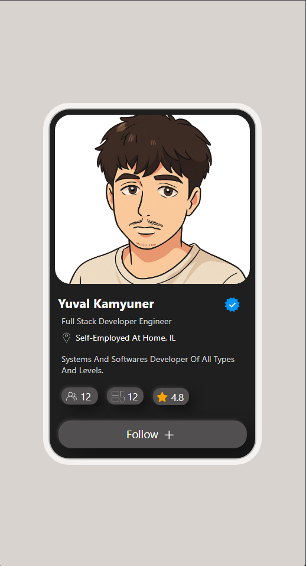

# Profile Card UI

A clean, dark-themed profile card component built with pure HTML and CSS — no frameworks, no JavaScript.



---

## 📋 Overview

This project is a stylized **profile card UI** designed to display a user's identity, role, stats, and a follow button — all inside a sleek dark card with rounded corners and a frosted-glass outline effect.

---

## 💡 Notes

- The card is centered on the page using `flexbox` on the `body`
- The page background uses a warm gray (`#d8d3cf`) to contrast with the dark card
- I used custom HTML tags (`<p2>`, `<p3>`) are used for text layers — these are non-standard and work visually but are not semantic HTML; `<span>` elements would be more appropriate in a production setting

---

## 🗂️ File Structure

```
├── index.html        # Card markup and structure
├── styles.css        # All styling and layout
├── profilepic.png    # User profile photo
├── verify.jpg        # Blue verification checkmark icon
├── loca.png          # Location pin icon
├── pepepep.webp      # People/connections icon
├── dashboard.png     # Dashboard/projects icon
├── starrevivew.png   # Star rating icon
├── pulsicon.png      # Plus icon (used in Follow button)
└── result.png        # Screenshot of the final result
```

---

## 🎨 Design Details

### Card
- Fixed size: **300×520px**
- Background: `#1f1f1f` (dark charcoal)
- Border radius: `32px` for the outer card, `24px` for the image box
- Frosted inner outline: `10px solid rgba(255,255,255,0.7)` with a negative offset to keep it inside the card

### Profile Image
- Takes up the **top half** of the card (~260px height)
- Cropped and centered using `object-fit: cover` with top alignment

### Profile Info
- Name displayed in bold white with a **blue verified badge** positioned to the right using negative margins
- Role, location (with icon), and bio displayed beneath using styled `<p>`, `<p2>`, and `<p3>` tags

### Stats Row
Three pill-shaped stat badges displayed inline:
| Badge | Value | Icon |
|-------|-------|------|
| Connections | 12 | People icon |
| Projects | 12 | Dashboard icon |
| Rating | 4.8 | Star icon |

Each badge uses:
- Background: `#514f4f`
- Border radius: `12px`
- Box shadow for a subtle 3D depth effect

### Follow Button
- Full-width rounded button (`border-radius: 20px`)
- Dark background with strong drop shadow and a soft inset highlight
- Contains "Follow" text and a `+` icon

---

## 🛠️ Technologies Used

| Technology | Purpose |
|------------|---------|
| HTML5 | Structure and layout |
| CSS3 | Styling, shadows, layout (Flexbox) |
| Custom icons | PNG/WebP/JPG image assets |
| Segoe UI font stack | Clean sans-serif typography |

---

## 🚀 How to Run

1. Make sure all image assets are in the **same folder** as `index.html`
2. Open `index.html` in any modern browser
3. No build tools or dependencies required

